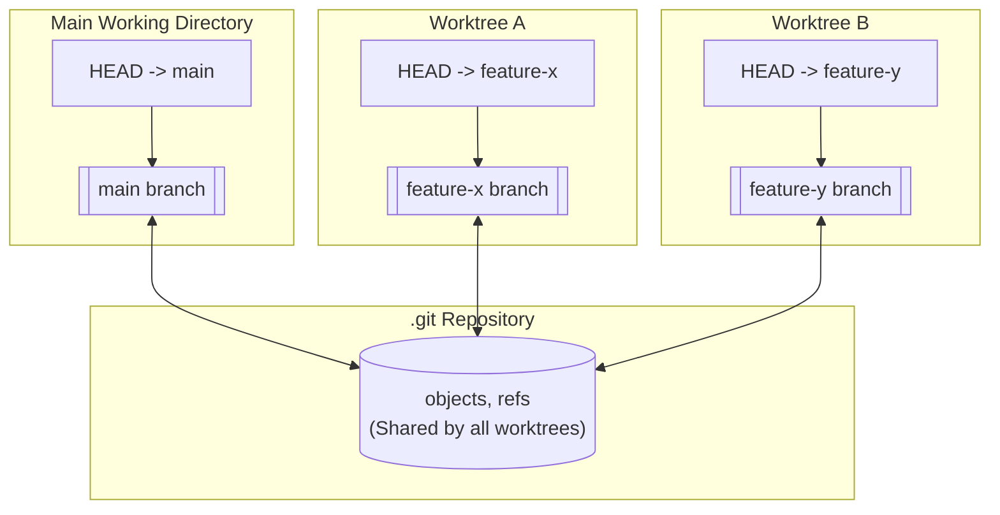

AI 코딩 에이전트에게 여러 작업을 동시에 맡길 때 `git worktree`가 어떻게, 왜 쓰이는지 정리해봤습니다.
<br><br>


AI 에이전트를 사용해 빠르게 개발하면서, git 자체에 내장된 기능인 `git worktree`를 알아봐야겠다 생각한 이유는 두 가지입니다.

1. 대기 시간을 줄이고 싶었습니다
   - AI 에이전트의 응답을 살펴보거나 기다리며 시간을 쓰는 경우가 많았습니다 -> 구현 범위가 명확히 나뉜 작업은 여러 에이전트에게 각각을 동시에 맡겨 빠르게 해결하고 싶었습니다
   - 같은 태스크를 여러 에이전트로 교차 검증해 부작용을 빠르게 찾아내고 보완한 뒤 다음 작업으로 넘어가는 방식도 좋지만, 여기서 생각한 아이디어는 작업을 병렬로 분배해 대기 시간 자체를 줄이는 쪽이었습니다
   - 예를 들어 마우스 드래그를 이용하는 편의 기능을 개발하던 중, 동시에 달력 렌더링 이슈와 필터 오류까지 해결해야 했던 적이 있습니다
2. 충돌을 줄이고 싶었습니다
   - 다른 채팅 세션에서 다음 작업의 요구사항을 정리하거나 구현 방향만 정해달라고 요청했는데, 에이전트가 스스로 판단해 구현까지 착수해버리는 경험이 반복됐습니다
   - 이렇게 여러 세션을 동시에 실행하면 에이전트들이 같은 코드를 함께 건드리는 경우가 많았는데, 이슈 원인을 찾던 중 워크트리라는 개념을 접하면서 `git worktree`가 정확히 뭔지 궁금해졌습니다

## git worktree

`git worktree`는 하나의 `.git` 저장소를 공유하면서 여러 개의 독립된 작업 디렉터리를 만들 수 있게 해주는 기능입니다.<br>
기존에는 다른 브랜치 작업을 시작하려면 `git checkout`으로 브랜치를 전환해야 했고, 작업 중이던 변경이 있다면 `stash`로 잠시 치워둬야 했습니다. 그런데 `git worktree`를 쓰면 이런 전환 없이 브랜치마다 별도 디렉터리를 만들어 동시에 열어두고 작업할 수 있습니다.

### 구조

`git checkout` 방식은 폴더가 하나뿐이라, 브랜치를 전환하면 그 폴더 안 파일 내용이 통째로 바뀝니다.

```text
project/
├── .git/
├── src/
└── ...
```

반면 `git worktree add ../project-feature-x feature-x`를 실행하면 디스크에 새 디렉터리가 하나 더 생깁니다.

```text
project/                  # main 브랜치 그대로 유지
├── .git/
├── src/
└── ...

project-feature-x/        # 새로 생긴 디렉터리
├── .git                  # 실제 저장소를 가리키는 파일
├── src/                  # feature-x 브랜치 파일들
└── ...
```

두 디렉터리는 물리적으로 분리되어 있어 각각 다른 브랜치를 체크아웃한 채 동시에 열어둘 수 있지만, `.git` 히스토리는 그대로 공유합니다.

### 구조 도식화

이 구조를 간단히 도식화하면 다음과 같습니다.



각 작업 디렉터리는 자신만의 `HEAD`로 서로 다른 브랜치를 가리키고 있어 파일 시스템은 분리돼있지만, 화살표 표시처럼 동일한 `.git` 저장소의 `objects`, `refs`를 향해 커밋을 남기고 히스토리를 읽어옵니다. 그래서 한쪽에서 커밋하면 다른 워크트리에서도 별도 동기화 없이 곧바로 그 커밋을 확인할 수 있습니다.

- `objects`:
  - 커밋, 파일 내용, 디렉터리 구조 같은 실제 데이터가 저장되는 곳입니다
  - 브랜치와 무관하게 저장소 전체가 공유합니다
- `refs`:
  - `main`, `feature-x`처럼 브랜치 이름이 어떤 커밋을 가리키는지 기록해둔 포인터입니다
  - 이것도 저장소 전체가 공유합니다
- `HEAD`:
  - 지금 이 작업 디렉터리가 어떤 브랜치를 체크아웃한 상태인지 가리키는 포인터입니다
  - 앞서 본 `git checkout feature-x`는 사실 이 저장소의 `HEAD`를 `main`에서 `feature-x`로 옮기는 동작입니다
  - `objects`와 `refs`는 모든 워크트리가 공유합니다
  - `HEAD`는 작업 디렉터리마다 따로 가지고 있어서 한쪽은 `main`을, 다른 쪽은 `feature-x`를 동시에 가리킬 수 있습니다

### `git clone`과의 차이

여러 작업 공간이 필요하다는 점만 보면 저장소를 여러 번 `clone`하는 것과 비슷해 보이지만, 공유하는 범위가 다릅니다.

- `git clone`
  - 완전히 독립된 저장소를 새로 만듭니다
  - `.git` 히스토리와 `objects`까지 전부 복제하기 때문에 디스크 사용량이 크고, 원본 저장소와 별도로 `fetch`해서 동기화해야 합니다
- `git worktree`
  - 원본 저장소의 `.git` `objects`, `refs`, 히스토리를 그대로 공유합니다
  - 작업 디렉터리만 분리되므로 생성 속도가 빠르고 디스크 사용량이 적습니다
  - 한쪽 워크트리에서 `fetch`하면 다른 워크트리에서도 곧바로 최신 `refs`를 볼 수 있습니다
  - 다만 같은 브랜치를 두 워크트리에서 동시에 체크아웃할 수는 없습니다

## 워크트리 병렬화의 장점과 단점

### 장점

- 작업 디렉터리가 파일 시스템 수준에서 물리적으로 분리돼있습니다
- 별도의 잠금 파일 같은 동시성 제어 장치 없이도 동시 쓰기 충돌이 원천적으로 발생하지 않습니다
- `objects`와 히스토리를 실시간 공유하기 때문에, 다른 워크트리에서 작업 중인 브랜치의 커밋 로그나 diff를 언제든 바로 참조할 수 있습니다

### 단점

- 병렬로 만든 브랜치들이 서로 다른 파일을 건드린다는 보장은 없습니다
- 두 태스크가 우연히 같은 파일을 수정하면 워크트리 단계에서는 충돌이 나지 않아도 병합 시점에 사람이나 오케스트레이터가 해결해야 할 수 있습니다
- 하나의 파일을 여러 에이전트가 함께 고쳐야 하는 태스크라면 병렬로 나누기보다는 교차 검증 방식이 더 적합할 수 있습니다
- 정리되지 않은 워크트리가 쌓이면 이후 병렬 작업을 위한 브랜치 이름이 꼬이거나 워크트리 리스트가 지저분해질 수 있습니다

## Takeaways

1. `git worktree`는 하나의 `.git` 저장소를 공유하면서 각자 다른 브랜치를 가리키는 `HEAD`를 가진 여러 작업 디렉터리를 만드는 git 고유 기능입니다
2. `git clone`보다 가볍게 여러 작업 공간을 만들 수 있습니다
3. 파일 시스템이 물리적으로 분리돼 있어 동시 쓰기 충돌이 나지 않지만, 태스크가 분리돼 있을 때 가장 효과적이며 겹친다면 결국 병합 시점에 충돌을 해결해야 합니다
   <br><br>
