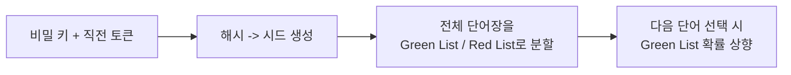
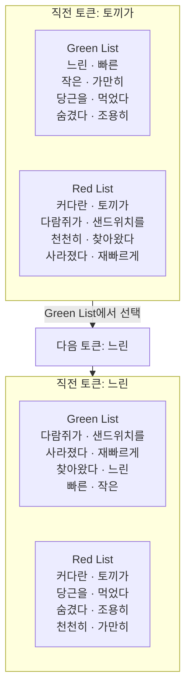

Google과 Anthropic 모두 AI로 생성한 텍스트에 워터마킹을 적용하고 있는데, 정확히 어떤 원리로 동작하는지 궁금해서 알아봤습니다.
  

AI를 통해 생성한 텍스트를 가려내는 방법은 크게 2가지입니다. 
통계 기반 탐지는 GPTZero처럼 이미 완성되어 있는 텍스트를 대상으로 그 안에 담긴 통계적 지문을 분석해서 AI가 썼을 확률을 추정하는 방식이고, 워터마킹은 텍스트가 만들어지는 순간에 눈에 보이지 않는 표식을 심어두는 방식입니다.

- GPTZero:
  - Princeton 대학생 Edward Tian이 2023년 1월 만든 AI 생성 텍스트 탐지 도구입니다
  - ChatGPT로 쓴 과제를 표절로 잡아내려는 목적에서 시작한 이후에 교육기관, 콘텐츠 플랫폼 등으로 활용 범위가 넓어졌습니다

### 통계 기반 탐지

초기에 GPTZero가 내세운 대표 지표는 perplexity와 burstiness입니다.

- perplexity:
  - 언어모델이 그 문장을 얼마나 예측 가능하다고 보는지를 나타냅니다
  - AI 텍스트는 확률 높은 단어를 순서대로 골라 만든 결과라 낮게 나오는 경향이 있습니다
  - 사람 텍스트는 어휘 선택이 튀어서 높게 나오는 경향이 있습니다
  - 예를 들어 "안녕하세요, 저는 __입니다"에서 다음 단어로 Siri가 나오면 perplexity가 낮고, 샌드위치가 나오면 perplexity가 높습니다
- burstiness:
  - 문장별 복잡도가 문서 전체에서 얼마나 들쭉날쭉한지를 나타냅니다
  - 사람은 문장 복잡도를 섞어 쓰는 반면 AI는 비교적 균일한 경향이 있습니다
  - 예를 들어 "바쁜 날입니다! 아침에 일찍 일어나 블로그 포스트를 작성해야 하고, 점심을 먹을 시간도 없이 친구를 데리러 가야 합니다."처럼 짧은 문장과 긴 문장을 섞어 쓰면 burstiness가 높고, 문장 길이와 복잡도가 비슷하게 이어지면 낮습니다

지금은 GPTZero도 위 대신 다른 방식을 사용합니다. 사람이 쓴 텍스트와 여러 LLM이 생성한 텍스트를 대량으로 모아 사람/AI로 라벨링한 뒤, 이 데이터로 end-to-end 딥러닝 분류 모델을 학습시켰습니다. 
perplexity나 burstiness처럼 사람이 미리 설계한 공식에 값을 대입하는 대신, 모델이 텍스트에서 구별 패턴을 스스로 학습하는 방식입니다.

- 판정:
  - 문서 전체가 아니라 문장 단위로 확률을 매깁니다
  - highly confident/moderately confident/uncertain 세 단계 신뢰도를 함께 표시합니다
  - 문서가 human-only/AI-only/mixed 중 어디에 해당하는지도 구분해서 알려줍니다

방법이 개선됐더라도 대량의 라벨링된 텍스트로 학습한 분류기가 내놓는 확률적 추정이라는 점은 같습니다. 추정이다 보니 오탐이 잦고, 특히 비원어민이 쓴 단순하고 반복적인 문장 구조가 AI 텍스트의 통계적 특징과 우연히 비슷해 보이는 경우 오작동한다는 지적이 있습니다.

## AI 텍스트 워터마킹

워터마킹은 반대로 생성 과정 자체에 관여하기 때문에, 표식이 남아있는 한 통계적으로 훨씬 신뢰도 높은 판정이 가능합니다. 
이 방식의 뼈대는 2023년 발표된 Kirchenbauer 등의 연구 [A Watermark for Large Language Models](https://arxiv.org/abs/2301.10226)에서 제안됐습니다.

### 동작 원리

LLM은 다음 단어를 결정할 때 하나의 정답이 아니라 여러 후보 단어에 확률을 분배합니다. 워터마킹은 나중에 통계적으로 추적이 가능한 신호를 남기려고 이 확률을 실제로 뽑기 전에 미리 조작해두는 방식입니다.

- 비밀 키와 직전 토큰을 해시해 시드 값을 만듭니다
- 이 시드로 전체 단어장을 Green List와 Red List로 무작위 분할합니다
- 다음 단어를 뽑을 때 Green List 쪽 확률을 살짝 올립니다

핵심은 이 시드를 만드는 방식에 있습니다.

- 시드는 직전 토큰마다 달라지기 때문에 텍스트의 위치마다 Green/Red List가 바뀝니다
- 시드는 비밀 키와 직전 토큰만으로 정해지는 순수 함수라, 저장하거나 전달하지 않아도 언제든 재현할 수 있습니다

확률을 올리는 정도도 조절할 수 있습니다.

- hard watermark:
  - 다음 단어를 고를 때 Green List에서만 고르도록 강하게 강제합니다
  - 생성된 텍스트의 단어가 100% Green List에서 나오면 워터마크가 강해집니다
  - 이런 경우 문장이 부자연스러워질 수 있습니다
- soft watermark:
  - 다음 단어를 고를 때 Green List 쪽 확률만 살짝 끌어올립니다
  - Red List 단어도 여전히 나올 수 있어서 Green 비율이 100%까지 가지 않고, 탐지 신뢰도는 hard watermark보다 낮아집니다
  - 대신 문장이 자연스러워집니다

이 편향은 아주 미세해서 텍스트를 읽는 사람은 눈치채기 어렵지만, 탐지는 바로 이 흔적을 거꾸로 추적하는 과정입니다.

- 사람이 쓴 텍스트:
  - Green List에 속한 단어의 비율은 약 50%입니다
  - Green/Red 분류 자체가 의미 없는 무작위 분할이라 특별히 편향을 줄 이유가 없으면 통계적으로 절반쯤이 Green에 속하게 됩니다
- 워터마크가 적용된 AI 텍스트:
  - 50%보다 뚜렷하게 높습니다
  - soft watermark면 대략 60-90% 사이 어딘가, hard watermark면 100%에 가깝습니다
- 워터마크가 적용되지 않은 AI 텍스트:
  - 사람 텍스트와 마찬가지로 약 50%입니다
  - 워터마크 지원 전에 나온 구형 모델이나, 워터마크를 지원하지 않는 플랫폼에서 생성된 텍스트가 여기 해당합니다
  - AI가 썼어도 이 방식으로는 사람 텍스트와 통계적으로 구분이 안 됩니다

이 방식이 실제로 판정하는 건 "AI가 썼는가"가 아니라 "워터마크가 적용된 상태로 생성됐는가"라는 뜻입니다.

### 예시

비밀 키가 `my-secret-key`이고 직전 토큰이 `토끼가`라면, `my-secret-key:토끼가`라는 문자열을 해시해 정수 시드 하나를 얻습니다. 
직전 토큰이 `토끼가`일 때 실제로 계산해보면 다음과 같이 갈립니다. Green List에서 `느린`을 골랐다고 하면, 다음 위치의 직전 토큰은 `느린`이 되고 리스트는 또 다르게 갈립니다.

`느린`, `빠른`, `작은`처럼 두 위치에서 계속 Green인 단어도 있지만, `다람쥐가`나 `샌드위치를`처럼 첫 번째 위치에서는 Red이었다가 두 번째 위치에서는 Green으로 넘어가는 단어도 있습니다. 리스트가 직전 토큰마다 다시 계산되기 때문에 벌어지는 일입니다.

## 탐지의 한계

- 짧은 텍스트에서는 탐지가 불안정합니다:
  - 통계적으로 유의미한 판정을 내리려면 충분한 토큰 수가 필요한데 텍스트가 짧으면 우연한 편차만으로도 판정이 흔들립니다
  - 실제 연구에서도 신뢰할 수 있는 탐지에는 대략 1,500단어 이상이 필요하다고 리포트합니다
- 의미를 유지하면서 문장을 다시 쓰면 워터마크가 크게 약해집니다:
  - 각 위치의 Green/Red 분류가 직전 토큰에 의존하기 때문입니다
  - 단어 순서나 표현이 바뀌면 연쇄가 끊기고 표식이 사라집니다
- 코드, 인용문, 사실 나열처럼 단어 선택의 여지가 거의 없는 텍스트는 애초에 편향을 줄 자리가 없어 워터마킹 자체가 어렵습니다
- 탐지에는 비밀 키가 필요합니다:
  - 개인이 임의로 검증할 수 없습니다
  - 제공자가 운영하는 검증 서비스나 API를 거쳐야 합니다
- 워터마크는 저자가 누구인지가 아니라 AI가 관여했는지만 나타냅니다:
  - 사람이 쓴 텍스트를 AI로 교정만 해도 표식이 남을 수 있습니다
  - 표식이 없다고 해서 AI가 전혀 관여하지 않았다고 단정할 수도 없습니다

## 실제 적용 현황

AI 콘텐츠 마킹은 지금 두 회사가 각자 다른 시점과 범위로 적용하고 있습니다.

- Google:
  - 2024년부터 Gemini 앱과 웹 환경에 SynthID 기반 워터마킹을 적용하고 있습니다
  - 텍스트 외에 이미지·오디오·비디오까지 지원 범위를 넓혀가는 중입니다
- Anthropic: 2026년 8월부터 신규 Claude 모델에 워터마킹을 적용하며 기존 모델에도 추후 적용할 계획입니다

두 회사 모두 검증은 자체 키나 별도 검증 도구를 통해서만 가능하도록 운영하고 있어, 제3자가 임의로 판별할 수 있는 구조는 아닙니다.

## Takeaways

1. AI 텍스트 워터마킹은 GPTZero 같은 통계 기반 사후 탐지와 달리, 생성 시점에 표식을 심어두는 방식입니다
2. 비밀 키와 직전 토큰으로 만든 시드로 단어장을 Green/Red List로 나누고, Green 쪽 확률을 살짝 끌어올려 표식을 남깁니다
3. 이 표식은 AI 처리 여부만 나타내고 짧은 텍스트·재작성 앞에서 신뢰도가 떨어지며, Google(2024년-)과 Anthropic(2026년 8월-)이 각자 적용 중이고 검증은 제공자를 통해서만 가능합니다
     

_출처: 
[1] declaude (["AI 텍스트 워터마킹의 작동 원리"](https://declaude.org/watermarking/)) 
[2] Kirchenbauer, J. et al. (["A Watermark for Large Language Models"](https://arxiv.org/abs/2301.10226)) 
[3] Google DeepMind (["SynthID"](https://deepmind.google/technologies/synthid/)) 
[4] GPTZero (["Technology"](https://gptzero.me/technology)) 
[5] GPTZero (["What is perplexity & burstiness for AI detection?"](https://gptzero.me/news/perplexity-and-burstiness-what-is-it/)) _
